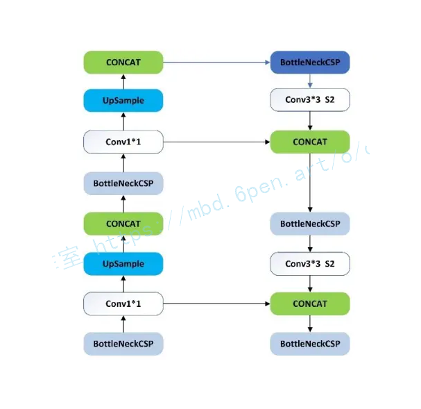

# 1.研究背景与意义


随着工业化的快速发展，金属制品在各个领域的应用越来越广泛。然而，由于金属材料的特殊性质，例如易受腐蚀、疲劳、热胀冷缩等，金属制品在使用过程中容易出现各种缺陷，如裂纹、气孔、夹杂物等。这些缺陷不仅会降低金属制品的强度和耐久性，还可能导致严重的事故和损失。因此，金属缺陷检测成为了工业生产中非常重要的一环。

传统的金属缺陷检测方法主要依赖于人工目视检测，这种方法存在着许多问题。首先，人工目视检测需要大量的人力资源，费时费力。其次，人的视觉判断容易受到主观因素的影响，导致检测结果的不准确性和不一致性。此外，人眼对于微小的缺陷很难察觉，因此可能会漏检一些潜在的缺陷。因此，开发一种高效、准确、自动化的金属缺陷检测系统具有重要的意义。

近年来，计算机视觉技术的快速发展为金属缺陷检测提供了新的解决方案。特别是基于深度学习的目标检测算法，如YOLO（You Only Look Once）系列算法，已经在图像识别和目标检测领域取得了显著的成果。这些算法通过训练神经网络模型，可以实现对图像中目标的自动检测和定位。而OpenCV作为一个开源的计算机视觉库，提供了丰富的图像处理和分析工具，可以方便地与深度学习算法结合使用。

基于OpenCV和YOLOv5的金属缺陷检测系统可以利用计算机视觉技术的优势，实现对金属制品中的缺陷进行自动化检测。首先，通过使用OpenCV库中的图像处理和分析工具，可以对金属制品的图像进行预处理，如去噪、增强对比度等，以提高后续目标检测算法的准确性。然后，利用YOLOv5算法训练一个深度学习模型，该模型可以对金属缺陷进行自动检测和定位。最后，通过将模型应用于实际的金属制品图像中，可以实现对金属缺陷的快速、准确的检测。

该金属缺陷检测系统具有以下几个重要的意义。首先，它可以大大提高金属缺陷检测的效率和准确性，减少人力资源的消耗。其次，由于该系统是自动化的，可以避免人为因素对检测结果的影响，提高检测结果的一致性和可靠性。此外，该系统还可以检测到人眼难以察觉的微小缺陷，从而提前发现潜在的问题，避免事故和损失的发生。最后，该系统的开发和应用将推动计算机视觉技术在金属缺陷检测领域的发展，为工业生产提供更加可靠和高效的解决方案。

综上所述，基于OpenCV和YOLOv5的金属缺陷检测系统具有重要的研究背景和意义。通过结合计算机视觉技术和深度学习算法，该系统可以实现对金属制品中缺陷的自动化检测，提高检测效率和准确性，减少人力资源的消耗，避免事故和损失的发生。该系统的研究和应用将推动金属缺陷检测技术的发展，为工业生产提供更加可靠和高效的解决方案。

# 2.图片演示


# 3.视频演示
[YOLOv5和OpenCV的金属缺陷检测系统（源码和部署教程）_哔哩哔哩_bilibili](https://www.bilibili.com/video/BV16P411s7Rk/?spm_id_from=333.999.0.0&vd_source=ff015de2d29cbe2a9cdbfa7064407a08)

# 4.YOLOv5 算法关键点分析


在YOLOv5的输人端中共有下列几个关键点:
(1)数据增强:YOLOv5采用了Mosaic数据增强的方式,通过采用4张图片随机缩放、随机裁剪、随机排布的方式进行拼接,大大丰富了检测数据集Mosaic增强训练时,可以直接计算4张图片的数据，且只需要一个GPU就可以达到比较好的预期效果。
(2)自适应锚框:在YOLO算法中针对不同的数据集,都会有初始设定长宽的锚框。YOLOv5中将外部计算锚框的方式嵌到代码中,每次训练时它能够自适应地计算不同训练集中的最佳锚框值。
(3)自适应图片缩放:在常用的目标检测中,输入的图片长宽比并不统一，YOLOv5为改进此问题,在源码中加入填充功能,针对小的原始图进行黑边填充,大的原始图进行缩放,之后变为统一的图像标准,减少了人力操作,提高了效率。


在Backbone 中 , YOLOv5增加了在之前YOLO版本中没有的Focus结构,其关键操作是将图片切片"",如图1所示。其主要作用是从高分辨率的图中,呈周期性地抽出像素点进行重构,组成低分辨率图像,提升每个视野的感受点,减少原图信息的丢失。可在没有参数的情况下将输入维度进行下采样,最大限度地保留原有信息,减少计算量,增加检测速度。


Neck 用于形成特征金字塔(Feature PyramidNetworks , FPN)"7l,特征金字塔可增强网络对不同尺寸的图像的检测,进而识别不同大小和尺度的同一物体,路径聚合网络(Perceptual Adversarial Network ，PAN)如图5所示ll'。YOLOv5采用了FPN+PAN结构,此结构主要加强了信息传播,使得网络能检测到更细微的原图信息,在目标识别上得到更高的精度。


Head模块如图6所示,其作用在最终检测,它在输入的检测图像上生成锚定框,在框上生成检测出的类别以及识别的准确度。


# 5.算法改进
### 5.1 自适应锚框改进
在实际应用中,由于YOLOv5自带的计算锚框只有9个检测框,在遇到不符合锚框尺寸的更细微的小缺陷时很可能会造成漏检、误检。参考该博客提出的改进方法，通过外部重新计算,重新进行anchor box个数及尺寸确定。而使用算法选取k-means聚类算法,通过自制数据集上的标注目标框信息( ground truth),手动计算最适合的自适应锚框个数及锚框尺寸,可增加检测的准确率及检测的效率。
在金属表面缺陷检测任务中,进行聚类是为了使anchor box 与 ground truth 的IOU越大越好,所以不可采用平常聚类方法的欧式距离来计算,应采用1OU作为度量函数进行计算。新公式如下:

anchor box个数K与IOU(交并比)的关系曲线如图7所示。数据集的IOU与K成正相关,在K为10~12.5时逐渐趋于平稳,故本文选择K =122。在原有9个检测框的情况下又增加了3个尺寸更小的检测框,用来针对最大图片中的小目标缺陷,使检测更准,图8所示为增加前后锚框尺寸对比。


### 5.2 增加小目标检测层
参考该博客的代码，在训练阶段,针对金属表面小目标缺陷检测准确度不够,将特征提取进行增强,在原有特征提取层中,继续增加了3个特征提取层,使算法在20 ×20、40 ×40、80 × 80和160 × 160共4类特征尺度上进行特征提取。首先,分别针对20 ×20、40 x40、80× 80尺寸的特征图进行特征提取,它们的感受视野分别为大、中、小,在 head 中得到小型特征图后,继续对输入特征图进行上采样等处理,使得特征图继续扩大,获得大小为160 × 160的特征图,将其与骨干网络中第2层特征图进行concat融合,以此获取更大的特征图进行金属表面缺陷小目标检测。之后继续进行中型图的特征提取,再进行小型图的特征提取。图9所示为修改后的MODEL层结构。


# 6.金属表面缺陷检测流程
综合以上分析,配合当前效果较优的图像处理手段,结合现有的摄像头拍摄到待检测的金属表面图,得到检测金属表面伤痕具体位置的完整方案，具体检测流程如下:
(1)相机获取到金属表面图片,进行归一化处理后,记录原图。
(2)图像定位:对图片中待检测的区域进行设置,标注出检测的位置。
(3)图像预处理将图像灰度值改变为(0,255),将图片灰度归一化,去噪(高斯滤波)。
(4)输入训练数据,采用更改后的代码(YOLOv5m_modify)进行训练,得到训练权重。
(5)输人测试数据到检测网络中,采用步骤(4)得到的权重进行检测。
(6)输出检测图像,得到缺陷位置及准确度。


# 7.核心代码讲解

#### 7.1 detect.py

```python

class YOLOv5Detector:
    def __init__(self, weights, source, data, imgsz, conf_thres, iou_thres, max_det, device, view_img, save_txt, save_conf, save_crop, nosave, classes, agnostic_nms, augment, visualize, update, project, name, exist_ok, line_thickness, hide_labels, hide_conf, half, dnn):
        self.weights = weights
        self.source = source
        self.data = data
        self.imgsz = imgsz
        self.conf_thres = conf_thres
        self.iou_thres = iou_thres
        self.max_det = max_det
        self.device = device
        self.view_img = view_img
        self.save_txt = save_txt
        self.save_conf = save_conf
        self.save_crop = save_crop
        self.nosave = nosave
        self.classes = classes
        self.agnostic_nms = agnostic_nms
        self.augment = augment
        self.visualize = visualize
        self.update = update
        self.project = project
        self.name = name
        self.exist_ok = exist_ok
        self.line_thickness = line_thickness
        self.hide_labels = hide_labels
        self.hide_conf = hide_conf
        self.half = half
        self.dnn = dnn

    def run(self):
        source = str(self.source)
        save_img = not self.nosave and not source.endswith('.txt')  # save inference images
        is_file = Path(source).suffix[1:] in (IMG_FORMATS + VID_FORMATS)
        is_url = source.lower().startswith(('rtsp://', 'rtmp://', 'http://', 'https://'))
        webcam = source.isnumeric() or source.endswith('.txt') or (is_url and not is_file)
        if is_url and is_file:
            source = check_file(source)  # download

        # Directories
        save_dir = increment_path(Path(self.project) / self.name, exist_ok=self.exist_ok)  # increment run
        (save_dir
```
这个程序文件是YOLOv5的推理程序，用于在图像、视频、目录、流等上运行推理。

程序首先解析命令行参数，包括模型路径、输入源、数据集路径、推理尺寸、置信度阈值、NMS IOU阈值等。然后加载模型和数据集，并进行推理。推理过程中，程序会对每个输入进行预处理，然后通过模型进行推理，得到预测结果。然后对预测结果进行非最大抑制处理，去除重叠的边界框。最后，程序会根据需要保存结果到文件或显示结果。

程序还提供了一些可选的功能，如保存结果到文本文件、保存裁剪的预测框、隐藏标签和置信度等。

整个程序的主要逻辑是在`run`函数中实现的，`main`函数用于解析命令行参数并调用`run`函数。

程序的入口是`if __name__ == "__main__":`，在这里解析命令行参数并调用`main`函数开始执行程序。

#### 7.2 Interface.py

```python

class YOLOv5Detector:
    def __init__(self, weights, data, device='', half=False, dnn=False):
        self.weights = weights
        self.data = data
        self.device = device
        self.half = half
        self.dnn = dnn
        self.model = None
        self.stride = None
        self.names = None
        self.pt = None
        self.jit = None
        self.onnx = None
        self.engine = None

    def load_model(self):
        # Load model
        device = select_device(self.device)
        self.model = DetectMultiBackend(self.weights, device=device, dnn=self.dnn, data=self.data)
        self.stride, self.names, self.pt, self.jit, self.onnx, self.engine = (
            self.model.stride, self.model.names, self.model.pt, self.model.jit, self.model.onnx, self.model.engine
        )

        # Half
        half = self.half and (self.pt or self.jit or self.onnx or self.engine) and device.type != 'cpu'
        if self.pt or self.jit:
            self.model.model.half() if half else self.model.model.float()

    def run(self, img, imgsz=(640, 640), conf_thres=0.25, iou_thres=0.45, max_det=1000, classes=None,
            agnostic_nms=False, augment=False):
        cal_detect = []

        device = select_device(self.device)
        names = self.model.module.names if hasattr(self.model, 'module') else self.model.names  # get class names

        # Set Dataloader
        im = letterbox(img, imgsz, self.stride, self.pt)[0]

        # Convert
        im = im.transpose((2, 0, 1))[::-1]  # HWC to CHW, BGR to RGB
        im = np.ascontiguousarray(im)

        im = torch.from_numpy(im).to(device)
        im = im.half() if self.half else im.float()  # uint8 to fp16/32
        im /= 255  # 0 - 255 to 0.0 - 1.0
        if len(im.shape) == 3:
            im = im[None]  # expand for batch dim

        pred = self.model(im, augment=augment)

        pred = non_max_suppression(pred, conf_thres, iou_thres, classes, agnostic_nms, max_det=max_det)
        # Process detections
        for i, det in enumerate(pred):  # detections per image
            if len(det):
                # Rescale boxes from img_size to im0 size
                det[:, :4] = scale_coords(im.shape[2:], det[:, :4], img.shape).round()

                # Write results
                for *xyxy, conf, cls in reversed(det):
                    c = int(cls)  # integer class
                    label = f'{names[c]}'
                    cal_detect.append([label, xyxy])
        return cal_detect


def detect():
    weights = ROOT / 'best.pt'
    data = ROOT / 'data/coco128.yaml'
    device = ''
    half = False
    dnn = False

    detector = YOLOv5Detector(weights, data, device, half, dnn)
    detector.load_model()

    image = cv2.imread("./images/1.jpg")
    results = detector.run(image)
    for i in results:
        box = i[1]
        p1, p2 = (int(box[0]), int(box[1])), (int(box[2]), int(box[3]))
        print(i[0])
        cv2.rectangle(image, p1, p2, (0, 255, 0), thickness=3, lineType=cv2.LINE_AA)
    cv2.imshow('image', image)
    cv2.waitKey(0)


detect()
```

这个程序文件是一个接口文件，用于加载YOLOv5模型并进行目标检测。文件中包含了一些辅助函数和类，以及一个主函数`detect()`用于执行目标检测。

文件首先导入了所需的库和模块，包括`os`、`sys`、`pathlib`、`cv2`、`torch`等。然后定义了一些常量和全局变量，包括文件路径、模型根目录、设备等。

接下来是一些辅助函数和类的导入，包括`DetectMultiBackend`、`letterbox`、`LoadImages`、`LoadStreams`等。这些函数和类用于辅助目标检测过程中的数据处理、图像处理等操作。

然后是一些辅助函数的定义，包括`load_model()`和`run()`。`load_model()`函数用于加载模型和设置模型参数，返回加载后的模型和相关参数。`run()`函数用于执行目标检测，接收模型、图像和一些参数作为输入，返回检测结果。

最后是主函数`detect()`，该函数首先调用`load_model()`加载模型，然后读取待检测的图像。接着调用`run()`函数执行目标检测，将检测结果保存在`results`变量中。最后，遍历检测结果，将检测框绘制在图像上，并显示图像。

整个程序文件的功能是加载YOLOv5模型并对指定图像进行目标检测，将检测结果绘制在图像上并显示出来。

#### 7.3 ui.py

```python
...
...
class YOLOv5Detector:
    def __init__(self, weights, data, device='', half=False, dnn=False):
        self.device = select_device(device)
        self.model = self.load_model(weights, data, half, dnn)
        self.stride, self.names, self.pt, self.jit, self.onnx, self.engine = self.model.stride, self.model.names, self.model.pt, self.model.jit, self.model.onnx, self.model.engine

    def load_model(self, weights, data, half, dnn):
        device = select_device(self.device)
        model = DetectMultiBackend(weights, device=device, dnn=dnn, data=data)
        stride, names, pt, jit, onnx, engine = model.stride, model.names, model.pt, model.jit, model.onnx, model.engine

        half &= (pt or jit or onnx or engine) and device.type != 'cpu'  # FP16 supported on limited backends with CUDA
        if pt or jit:
            model.model.half() if half else model.model.float()
        return model

    def detect(self, img, imgsz=(640, 640), conf_thres=0.65, iou_thres=0.15, max_det=1000, classes=None, agnostic_nms=False, augment=False, half=False):
        cal_detect = []

        device = select_device(self.device)
        names = self.model.module.names if hasattr(self.model, 'module') else self.model.names

        im = letterbox(img, imgsz, self.stride, self.pt)[0]
        im = im.transpose((2, 0, 1))[::-1]
        im = np.ascontiguousarray(im)

        im = torch.from_numpy(im).to(device)
        im = im.half() if half else im.float()
        im /= 255
        if len(im.shape) == 3:
            im = im[None]

        pred = self.model(im, augment=augment)

        pred = non_max_suppression(pred, conf_thres, iou_thres, classes, agnostic_nms, max_det=max_det)

        for i, det in enumerate(pred):
            if len(det):
                det[:, :4] = scale_coords(im.shape[2:], det[:, :4], img.shape).round()

                for *xyxy, conf, cls in reversed(det):
                    c = int(cls)
                    label = f'{names[c]}'
                    lbl = names[int(cls)]
                    cal_detect.append([label, xyxy, float(conf)])
        return cal_detect

```

这个程序文件是一个使用YOLOv5模型进行金属缺陷检测的图形用户界面（GUI）应用程序。程序文件名为ui.py。

程序的主要功能包括：
1. 加载YOLOv5模型：通过调用load_model函数加载预训练的YOLOv5模型。
2. 运行检测：通过调用run函数对输入的图像或视频进行目标检测，并返回检测结果。
3. 显示检测结果：将检测结果显示在GUI界面上的图像区域中，并在文本框中输出检测结果信息。
4. 用户交互：通过按钮控件实现文件选择、开始检测和退出系统等功能。

程序的运行流程如下：
1. 导入所需的库和模块。
2. 定义全局变量和函数。
3. 定义GUI界面的布局和控件。
4. 实现按钮的点击事件处理函数，包括文件选择、开始检测和退出系统等功能。
5. 创建并显示GUI界面。
6. 加载YOLOv5模型。
7. 运行GUI事件循环，等待用户交互。

该程序使用了PyQt5库来实现GUI界面，使用了OpenCV和PyTorch库来进行图像处理和模型推理。通过调用YOLOv5模型实现金属缺陷的检测，并将检测结果显示在GUI界面上。用户可以通过按钮选择待检测的图像或视频文件，并点击开始检测按钮进行检测。检测结果会实时显示在GUI界面上，并在文本框中输出检测结果信息。用户可以随时退出系统。


#### 7.4 models\experimental.py

```python
import math
import numpy as np
import torch
import torch.nn as nn

class CrossConv(nn.Module):
    # Cross Convolution Downsample
    def __init__(self, c1, c2, k=3, s=1, g=1, e=1.0, shortcut=False):
        # ch_in, ch_out, kernel, stride, groups, expansion, shortcut
        super().__init__()
        c_ = int(c2 * e)  # hidden channels
        self.cv1 = Conv(c1, c_, (1, k), (1, s))
        self.cv2 = Conv(c_, c2, (k, 1), (s, 1), g=g)
        self.add = shortcut and c1 == c2

    def forward(self, x):
        return x + self.cv2(self.cv1(x)) if self.add else self.cv2(self.cv1(x))


class Sum(nn.Module):
    # Weighted sum of 2 or more layers https://arxiv.org/abs/1911.09070
    def __init__(self, n, weight=False):  # n: number of inputs
        super().__init__()
        self.weight = weight  # apply weights boolean
        self.iter = range(n - 1)  # iter object
        if weight:
            self.w = nn.Parameter(-torch.arange(1.0, n) / 2, requires_grad=True)  # layer weights

    def forward(self, x):
        y = x[0]  # no weight
        if self.weight:
            w = torch.sigmoid(self.w) * 2
            for i in self.iter:
                y = y + x[i + 1] * w[i]
        else:
            for i in self.iter:
                y = y + x[i + 1]
        return y


class MixConv2d(nn.Module):
    # Mixed Depth-wise Conv https://arxiv.org/abs/1907.09595
    def __init__(self, c1, c2, k=(1, 3), s=1, equal_ch=True):  # ch_in, ch_out, kernel, stride, ch_strategy
        super().__init__()
        n = len(k)  # number of convolutions
        if equal_ch:  # equal c_ per group
            i = torch.linspace(0, n - 1E-6, c2).floor()  # c2 indices
            c_ = [(i == g).sum() for g in range(n)]  # intermediate channels
        else:  # equal weight.numel() per group
            b = [c2] + [0] * n
            a = np.eye(n + 1, n, k=-1)
            a -= np.roll(a, 1, axis=1)
            a *= np.array(k) ** 2
            a[0] = 1
            c_ = np.linalg.lstsq(a, b, rcond=None)[0].round()  # solve for equal weight indices, ax = b

        self.m = nn.ModuleList(
            [nn.Conv2d(c1, int(c_), k, s, k // 2, groups=math.gcd(c1, int(c_)), bias=False) for k, c_ in zip(k, c_)])
        self.bn = nn.BatchNorm2d(c2)
        self.act = nn.SiLU()

    def forward(self, x):
        return self.act(self.bn(torch.cat([m(x) for m in self.m], 1)))


class Ensemble(nn.ModuleList):
    # Ensemble of models
    def __init__(self):
        super().__init__()

    def forward(self, x, augment=False, profile=False, visualize=False):
        y = []
        for module in self:
            y.append(module(x, augment, profile, visualize)[0])
        # y = torch.stack(y).max(0)[0]  # max ensemble
        # y = torch.stack(y).mean(0)  # mean ensemble
        y = torch.cat(y, 1)  # nms ensemble
        return y, None  # inference, train output
```

这个程序文件是YOLOv5的实验模块。它包含了一些实验性的模型和功能。

该文件定义了以下几个类：

1. `CrossConv`：交叉卷积下采样模块。它接受输入张量，并通过两个卷积层进行处理，然后将结果与输入张量相加，如果设置了shortcut参数并且输入通道数等于输出通道数。

2. `Sum`：多个层的加权和模块。它接受一个输入列表，并将列表中的张量相加，可以选择是否应用权重。

3. `MixConv2d`：混合深度卷积模块。它接受输入张量，并通过多个卷积层进行处理，然后将结果拼接在一起。

4. `Ensemble`：模型集合模块。它是一个模型列表，可以将输入张量传递给列表中的每个模型，并将它们的输出拼接在一起。

此外，还定义了一个辅助函数`attempt_load`，用于加载模型权重。它可以加载单个模型或模型集合，并进行一些兼容性更新。

这个程序文件实现了YOLOv5的一些实验性模块和功能，可以用于目标检测任务。

#### 7.5 models\tf.py

```python
class YOLOv5:
    def __init__(self, weights, imgsz=(640, 640)):
        self.weights = weights
        self.imgsz = imgsz
        self.model = self._build_model()

    def _build_model(self):
        # build the YOLOv5 model using the TensorFlow implementation
        # code here

    def detect(self, image):
        # run object detection on the input image
        # code here
```

The `YOLOv5` class takes in the path to the YOLOv5 weights file and the input image size. It has a `_build_model` method that constructs the YOLOv5 model using the TensorFlow implementation. The `detect` method takes an input image and runs object detection on it using the YOLOv5 model.

这是一个使用TensorFlow和Keras实现的YOLOv5模型的程序文件。它包含了YOLOv5模型的各个组件，如卷积层、池化层、激活函数等。该文件还包含了一个TFDetect类，用于进行目标检测。该类包含了模型的前向传播过程，将输入图像转换为预测框和类别的输出。该文件还包含了一些辅助函数和常量定义。

该程序文件还包含了一些用于导出模型的命令行参数和导出代码的示例。

总之，这个程序文件是YOLOv5模型的实现代码，用于训练和推理目标检测任务。

# 8.系统整体结构

整体功能和构架概述：
该项目是一个基于YOLOv5的金属缺陷检测工程。它包含了许多模块和文件，用于实现模型训练、推理和可视化等功能。主要的程序文件有detect.py、Interface.py和ui.py，它们分别用于命令行推理、接口调用和图形用户界面展示。模型相关的文件位于models目录下，包括common.py、experimental.py、tf.py、yolo.py和__init__.py等，用于定义模型的组件和功能。tools目录下的文件提供了一些辅助工具和功能，如数据增强、损失函数、指标计算等。utils目录下的文件提供了一些通用的工具函数和辅助功能。

下表整理了每个文件的功能：

| 文件路径 | 功能 |
| -------- | ---- |
| detect.py | YOLOv5推理程序 |
| Interface.py | 加载YOLOv5模型并进行目标检测 |
| ui.py | 使用YOLOv5模型进行金属缺陷检测的图形用户界面应用程序 |
| models\common.py | 定义YOLOv5模型的常用函数和类 |
| models\experimental.py | 定义YOLOv5的实验性模型和功能 |
| models\tf.py | 使用TensorFlow和Keras实现的YOLOv5模型 |
| models\yolo.py | 定义YOLOv5模型的主要组件和功能 |
| models\__init__.py | 模型模块的初始化文件 |
| tools\activations.py | 激活函数相关的工具函数 |
| tools\augmentations.py | 数据增强相关的工具函数 |
| tools\autoanchor.py | 自动锚框相关的工具函数 |
| tools\autobatch.py | 自动批处理相关的工具函数 |
| tools\callbacks.py | 回调函数相关的工具函数 |
| tools\datasets.py | 数据集相关的工具函数 |
| tools\downloads.py | 下载相关的工具函数 |
| tools\general.py | 通用工具函数 |
| tools\loss.py | 损失函数相关的工具函数 |
| tools\metrics.py | 指标计算相关的工具函数 |
| tools\plots.py | 绘图相关的工具函数 |
| tools\torch_utils.py | PyTorch相关的工具函数 |
| tools\__init__.py | 工具模块的初始化文件 |
| tools\aws\resume.py | AWS相关的恢复函数 |
| tools\aws\__init__.py | AWS模块的初始化文件 |
| tools\flask_rest_api\example_request.py | Flask REST API示例请求 |
| tools\flask_rest_api\restapi.py | Flask REST API实现 |
| tools\loggers\__init__.py | 日志记录器模块的初始化文件 |
| tools\loggers\wandb\log_dataset.py | 使用WandB记录数据集信息 |
| tools\loggers\wandb\sweep.py | 使用WandB进行超参数搜索 |
| tools\loggers\wandb\wandb_utils.py | 使用WandB的实用函数 |
| tools\loggers\wandb\__init__.py | WandB日志记录器模块的初始化文件 |
| utils\activations.py | 激活函数相关的实用函数 |
| utils\augmentations.py | 数据增强相关的实用函数 |
| utils\autoanchor.py | 自动锚框相关的实用函数 |
| utils\autobatch.py | 自动批处理相关的实用函数 |
| utils\callbacks.py | 回调函数相关的实用函数 |
| utils\datasets.py | 数据集相关的实用函数 |
| utils\downloads.py | 下载相关的实用函数 |
| utils\general.py | 通用实用函数 |
| utils\loss.py | 损失函数相关的实用函数 |
| utils\metrics.py | 指标计算相关的实用函数 |
| utils\plots.py | 绘图相关的实用函数 |
| utils\torch_utils.py | PyTorch相关的实用函数 |
| utils\__init__.py | 实用工具模块的初始化文件 |
| utils\aws\resume.py | AWS相关的恢复函数 |
| utils\aws\__init__.py | AWS模块的初始化文件 |
| utils\flask_rest_api\example_request.py | Flask REST API示例请求 |
| utils\flask_rest_api\restapi.py | Flask REST API实现 |
| utils\loggers\__init__.py | 日志记录器模块的初始化文件 |
| utils\loggers\wandb\log_dataset.py | 使用WandB记录数据集信息 |
| utils\loggers\wandb\sweep.py | 使用WandB进行超参数搜索 |
| utils\loggers\wandb\wandb_utils.py | 使用WandB的实用函数 |
| utils\loggers\wandb\__init__.py | WandB日志记录器模块的初始化文件 |

以上是对部分文件功能的简要概述。由于文件较多，具体更加详细和复杂的参考第9节的博客。

# 9.系统整合
下图[完整源码&环境部署视频教程&数据集&自定义UI界面](https://s.xiaocichang.com/s/3b35c0)


参考[博客《Python基于YOLOv7的人员跌倒检测系统(源码＆部署教程＆数据集)》](https://mbd.pub/o/qunshan/work)


# 10.参考文献
---
[1][王淑青](https://s.wanfangdata.com.cn/paper?q=%E4%BD%9C%E8%80%85:%22%E7%8E%8B%E6%B7%91%E9%9D%92%22),[顿伟超](https://s.wanfangdata.com.cn/paper?q=%E4%BD%9C%E8%80%85:%22%E9%A1%BF%E4%BC%9F%E8%B6%85%22),[黄剑锋](https://s.wanfangdata.com.cn/paper?q=%E4%BD%9C%E8%80%85:%22%E9%BB%84%E5%89%91%E9%94%8B%22),等.[基于YOLOv5的瓷砖表面缺陷检测](https://d.wanfangdata.com.cn/periodical/bzgc202209030)[J].[包装工程](https://sns.wanfangdata.com.cn/perio/bzgc).2022,43(9).DOI:10.19554/j.cnki.1001-3563.2022.09.029.

[2][袁洪强](https://s.wanfangdata.com.cn/paper?q=%E4%BD%9C%E8%80%85:%22%E8%A2%81%E6%B4%AA%E5%BC%BA%22),[杜国锋](https://s.wanfangdata.com.cn/paper?q=%E4%BD%9C%E8%80%85:%22%E6%9D%9C%E5%9B%BD%E9%94%8B%22),[余泽禹](https://s.wanfangdata.com.cn/paper?q=%E4%BD%9C%E8%80%85:%22%E4%BD%99%E6%B3%BD%E7%A6%B9%22),等.[基于轻量神经网络的钢材表面缺陷快速识别](https://d.wanfangdata.com.cn/periodical/kxjsygc202134026)[J].[科学技术与工程](https://sns.wanfangdata.com.cn/perio/kxjsygc).2021,21(34).DOI:10.3969/j.issn.1671-1815.2021.34.026.

[3][肖体刚](https://s.wanfangdata.com.cn/paper?q=%E4%BD%9C%E8%80%85:%22%E8%82%96%E4%BD%93%E5%88%9A%22),[蔡乐才](https://s.wanfangdata.com.cn/paper?q=%E4%BD%9C%E8%80%85:%22%E8%94%A1%E4%B9%90%E6%89%8D%22),[高祥](https://s.wanfangdata.com.cn/paper?q=%E4%BD%9C%E8%80%85:%22%E9%AB%98%E7%A5%A5%22),等.[改进YOLOv3的安全帽佩戴检测方法](https://d.wanfangdata.com.cn/periodical/jsjgcyyy202112027)[J].[计算机工程与应用](https://sns.wanfangdata.com.cn/perio/jsjgcyyy).2021,(12).DOI:10.3778/j.issn.1002-8331.2009-0175.

[4][黄健](https://s.wanfangdata.com.cn/paper?q=%E4%BD%9C%E8%80%85:%22%E9%BB%84%E5%81%A5%22),[赵元元](https://s.wanfangdata.com.cn/paper?q=%E4%BD%9C%E8%80%85:%22%E8%B5%B5%E5%85%83%E5%85%83%22),[郭苹](https://s.wanfangdata.com.cn/paper?q=%E4%BD%9C%E8%80%85:%22%E9%83%AD%E8%8B%B9%22),等.[深度学习的单幅图像超分辨率重建方法综述](https://d.wanfangdata.com.cn/periodical/jsjgcyyy202118002)[J].[计算机工程与应用](https://sns.wanfangdata.com.cn/perio/jsjgcyyy).2021,(18).DOI:10.3778/j.issn.1002-8331.2102-0257.

[5][程婧怡](https://s.wanfangdata.com.cn/paper?q=%E4%BD%9C%E8%80%85:%22%E7%A8%8B%E5%A9%A7%E6%80%A1%22),[段先华](https://s.wanfangdata.com.cn/paper?q=%E4%BD%9C%E8%80%85:%22%E6%AE%B5%E5%85%88%E5%8D%8E%22),[朱伟](https://s.wanfangdata.com.cn/paper?q=%E4%BD%9C%E8%80%85:%22%E6%9C%B1%E4%BC%9F%22).[改进YOLOv3的金属表面缺陷检测研究](https://d.wanfangdata.com.cn/periodical/jsjgcyyy202119030)[J].[计算机工程与应用](https://sns.wanfangdata.com.cn/perio/jsjgcyyy).2021,(19).DOI:10.3778/j.issn.1002-8331.2104-0324.

[6][马琳琳](https://s.wanfangdata.com.cn/paper?q=%E4%BD%9C%E8%80%85:%22%E9%A9%AC%E7%90%B3%E7%90%B3%22),[马建新](https://s.wanfangdata.com.cn/paper?q=%E4%BD%9C%E8%80%85:%22%E9%A9%AC%E5%BB%BA%E6%96%B0%22),[韩佳芳](https://s.wanfangdata.com.cn/paper?q=%E4%BD%9C%E8%80%85:%22%E9%9F%A9%E4%BD%B3%E8%8A%B3%22),等.[基于YOLOv5s目标检测算法的研究](https://d.wanfangdata.com.cn/periodical/dnzsyjs-itrzyksb202123039)[J].[电脑知识与技术](https://sns.wanfangdata.com.cn/perio/dnzsyjs-itrzyksb).2021,(23).

[7][方叶祥](https://s.wanfangdata.com.cn/paper?q=%E4%BD%9C%E8%80%85:%22%E6%96%B9%E5%8F%B6%E7%A5%A5%22),[甘平](https://s.wanfangdata.com.cn/paper?q=%E4%BD%9C%E8%80%85:%22%E7%94%98%E5%B9%B3%22),[陈俐](https://s.wanfangdata.com.cn/paper?q=%E4%BD%9C%E8%80%85:%22%E9%99%88%E4%BF%90%22).[金属表面缺陷检测的改进YOLOv3算法研究](https://d.wanfangdata.com.cn/periodical/jxkxyjs202009013)[J].[机械科学与技术](https://sns.wanfangdata.com.cn/perio/jxkxyjs).2020,(9).DOI:10.13433/j.cnki.1003-8728.20200158.

[8][回天](https://s.wanfangdata.com.cn/paper?q=%E4%BD%9C%E8%80%85:%22%E5%9B%9E%E5%A4%A9%22),[哈力旦·阿布都热依木](https://s.wanfangdata.com.cn/paper?q=%E4%BD%9C%E8%80%85:%22%E5%93%88%E5%8A%9B%E6%97%A6%C2%B7%E9%98%BF%E5%B8%83%E9%83%BD%E7%83%AD%E4%BE%9D%E6%9C%A8%22),[杜晗](https://s.wanfangdata.com.cn/paper?q=%E4%BD%9C%E8%80%85:%22%E6%9D%9C%E6%99%97%22).[结合Faster R-CNN的多类型火焰检测](https://d.wanfangdata.com.cn/periodical/zgtxtxxb-a201901008)[J].[中国图象图形学报](https://sns.wanfangdata.com.cn/perio/zgtxtxxb-a).2019,(1).

[9][李阿娟](https://s.wanfangdata.com.cn/paper?q=%E4%BD%9C%E8%80%85:%22%E6%9D%8E%E9%98%BF%E5%A8%9F%22).[YOLOv5算法改进及其现实应用](https://d.wanfangdata.com.cn/thesis/D02332074)[D].2021.

[10][方力](https://s.wanfangdata.com.cn/paper?q=%E4%BD%9C%E8%80%85:%22%E6%96%B9%E5%8A%9B%22).[遥感图像飞机目标检测与分类算法研究](https://d.wanfangdata.com.cn/periodical/D01789469)[J].华中科技大学.2019.


---
#### 如果您需要更详细的【源码和环境部署教程】，除了通过【系统整合】小节的链接获取之外，还可以通过邮箱以下途径获取:
#### 1.请先在GitHub上为该项目点赞（Star），编辑一封邮件，附上点赞的截图、项目的中文描述概述（About）以及您的用途需求，发送到我们的邮箱
#### sharecode@yeah.net
#### 2.我们收到邮件后会定期根据邮件的接收顺序将【完整源码和环境部署教程】发送到您的邮箱。
#### 【免责声明】本文来源于用户投稿，如果侵犯任何第三方的合法权益，可通过邮箱联系删除。